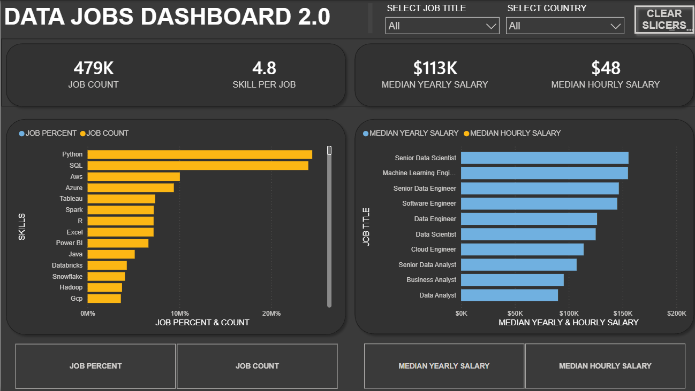

# Data Jobs Dashboard 2.0

An interactive **Power BI dashboard** built to analyze the data job market across job demand, skills, salaries, job titles, and countries.

## Project Overview

The objective of this project was to analyze data job postings and build an interactive Power BI dashboard that provides insights into job demand, required skills, and salary levels across different data-related roles.

The dashboard allows users to explore the data using interactive filters for **Job Title** and **Country**.

## Key Analysis

The dashboard analyzes:

- Overall data job volume
- Skills associated with data jobs
- Job percentage and job count by skill
- Median yearly salary by job title
- Median hourly salary by job title
- Salary comparisons across data-related roles
- Job analysis by country
- Interactive filtering by job title and country

## Dashboard

The Power BI dashboard provides an interactive view of the data job market using KPI cards, skill analysis, salary comparisons, and interactive slicers.



## Key Dashboard Metrics

| Metric | Value |
|---|---:|
| Job Count | 479K |
| Skills per Job | 4.8 |
| Median Yearly Salary | $113K |
| Median Hourly Salary | $48 |

The dashboard also enables users to explore job and salary patterns using **Job Title** and **Country** filters.

## Power BI Analysis

Power BI was used to transform the dataset into an interactive analytical dashboard.

The project demonstrates:

- Data transformation
- Data modeling
- DAX calculations
- KPI development
- Interactive filtering
- Data visualization
- Salary analysis
- Skill-demand analysis
- Comparative analysis

## Tools & Skills

**Power BI | DAX | Data Analysis | Data Visualization | Dashboard Development | Data Modeling**

## Project Workflow

**Data Preparation → Data Modeling → DAX Calculations → Visualization → Interactive Dashboard**

## Repository Contents

- **Power BI** — Interactive Power BI dashboard
- **Screenshot** — Dashboard preview
- **README.md** — Project documentation

## Project Structure

```text
data-jobs-dashboard/
│
├── Power BI/
│   └── Data Jobs Dashboard.pbix
│
├── Screenshot/
│   └── Dashboard.png
│
└── README.md
